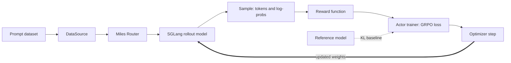

这是一份以“理解框架”为目标的动手教程。完成后，你应该能够回答：

- Miles 为什么同时需要 SGLang、训练后端和 Ray；
- 一个 prompt 如何变成 response、reward、advantage、loss 和新权重；
- actor、reference 和 rollout model 是三份什么模型；
- 同步训练、异步训练、colocate 和 disaggregated 分别改变了什么；
- 出问题时应先检查 rollout、training 还是 weight update；
- 要支持一种新 GPU，需要改设备、通信、调度还是 kernel。

本文基于 Miles `f2b7c792`（2026-08-26 的 `main`）。镜像和依赖会变化，运行前必须
记录实际 commit、镜像 digest 和软件版本。

## 先选合适的学习环境

推荐先用 NVIDIA 环境理解 Miles，再研究 MUSA 适配。当前 Miles 尚未完成 MUSA 支持；
若同时调试框架和新硬件，很难判断失败来自 Miles 逻辑还是 MUSA 兼容层。

| 环境 | 能完成什么 | 建议 |
| --- | --- | --- |
| 1×H100 80 GB 或 H200 141 GB | 独立 SGLang、缩小后的 colocate RL 闭环、rollout 录制回放 | 最低成本探索配置；当前仓库没有对应的单卡完整 E2E 结果 |
| 2×H200 | Qwen3-0.6B FSDP colocate、rollout 录制回放、两步 RL | **本文推荐**；当前仓库有对应两卡 H200 E2E 配方 |
| 2×H100 80 GB | 大概率可运行缩小后的 Qwen3-0.6B 实验 | 可以尝试，但不能把 H200 CI 结果当作 H100 实测证明 |
| 4×H200 | trainer/rollout 分卡、同步与异步对比 | 第二阶段学习 |
| 8×H100/H200 | 官方 Qwen3-4B Megatron quick start | 理解完成后的正式训练体验 |

单卡不是不能运行完整闭环。`--colocate` 会让 actor 和 rollout engine
共用同一组 GPU；当只有一张卡时，Miles 会在 rollout 与 training 阶段之间
切换并执行 offload/onload。单卡的限制是显存余量更小、运行更慢，而且无法
观察 FSDP 多 rank 行为。

主机建议预留至少 200 GB 空间用于镜像、模型、数据和 Ray 日志。单卡
实验建议至少 64 GB 主机内存，128 GB 会为 offload 和 Ray 留出更宽松的余量。
若准备继续做 Qwen3-4B 或多个 checkpoint，按官方 quick start 预留 500 GB。

## Miles 的宏观模型

Miles 不是一个单独的训练进程。它用 Ray 把生成、打分、训练和权重同步组织成循环：



要始终区分三种“模型”：

| 模型 | 是否训练 | 作用 |
| --- | --- | --- |
| Actor | 是 | 重新计算 log-prob，计算 GRPO/PPO loss，执行 optimizer step |
| Reference | 否 | 提供 KL baseline；只有启用相关配置时才需要 |
| Rollout model | 不直接反向传播 | SGLang 中用于高吞吐生成；每轮接收 actor 的新权重 |

Miles 最关键的闭环不是“模型能 forward”，而是：

```text
rollout 使用版本 N 的权重
  → actor 用这些 samples 更新到版本 N+1
  → N+1 权重完整到达 SGLang
  → 下一轮 rollout 确实使用 N+1
```

## 第 0 步：在 GPU 主机准备目录

以下命令在一台专用的单卡或两卡 GPU 主机上执行。教程固定使用
`/data/miles-learning`，不需要替换尖括号占位符。

```bash
sudo mkdir -p \
  /data/miles-learning/hf-cache \
  /data/miles-learning/models \
  /data/miles-learning/datasets \
  /data/miles-learning/shared_data
sudo chown -R "$(id -u):$(id -g)" /data/miles-learning

git clone https://github.com/radixark/miles.git /data/miles-learning/miles
cd /data/miles-learning/miles
git rev-parse HEAD
```

检查硬件、驱动、磁盘和 Docker：

```bash
nvidia-smi -L
nvidia-smi --query-gpu=index,name,memory.total,driver_version --format=csv
df -h /data /var/lib/docker
docker version
docker run --rm --gpus '"device=0"' ubuntu nvidia-smi -L
docker run --rm --gpus '"device=0,1"' ubuntu nvidia-smi -L
```

单卡主机只执行 `device=0` 的检查；两卡主机再执行 `device=0,1`。成功
标志是容器内只列出被授权的 GPU，且型号、显存和驱动符合预期。

## 第 1 步：启动可重复使用的 Miles 容器

本教程只把官方 `radixark/miles:latest` 镜像作为学习基线。不要直接进入一个
来源不明的现有容器后开始安装：Miles 依赖固定或带补丁的 SGLang、
Megatron-LM、FlashAttention 和 CUDA kernel，普通 `pip install -r requirements.txt`
不能完整重建这个 GPU 运行时。

单卡和两卡命令不要同时执行。只有一张卡时，在主机上使用：

```bash
docker pull radixark/miles:latest
docker image inspect radixark/miles:latest \
  --format 'image_id={{.Id}} repo_digest={{index .RepoDigests 0}}'

docker run -d \
  --name miles-learn \
  --gpus '"device=0"' \
  --ipc=host \
  --shm-size=32g \
  --ulimit memlock=-1 \
  --ulimit stack=67108864 \
  --network=host \
  -v /data/miles-learning/miles:/workspace/miles \
  -v /data/miles-learning/hf-cache:/root/.cache/huggingface \
  -v /data/miles-learning/models:/root/models \
  -v /data/miles-learning/datasets:/root/datasets \
  -v /data/miles-learning/shared_data:/root/shared_data \
  radixark/miles:latest \
  /bin/bash -lc 'sleep infinity'
```

有两张卡时，将上面容器命令中的 GPU 参数替换为：

```bash
--gpus '"device=0,1"'
```

如果希望直接复制完整的两卡命令，使用：

```bash
docker run -d \
  --name miles-learn \
  --gpus '"device=0,1"' \
  --ipc=host \
  --shm-size=32g \
  --ulimit memlock=-1 \
  --ulimit stack=67108864 \
  --network=host \
  -v /data/miles-learning/miles:/workspace/miles \
  -v /data/miles-learning/hf-cache:/root/.cache/huggingface \
  -v /data/miles-learning/models:/root/models \
  -v /data/miles-learning/datasets:/root/datasets \
  -v /data/miles-learning/shared_data:/root/shared_data \
  radixark/miles:latest \
  /bin/bash -lc 'sleep infinity'
```

容器启动后，先在主机上记录它真正使用的镜像：

```bash
docker inspect miles-learn \
  --format 'configured_image={{.Config.Image}} image_id={{.Image}}'
docker image inspect radixark/miles:latest \
  --format 'expected_image_id={{.Id}} repo_digest={{index .RepoDigests 0}}'
```

`image_id` 必须与 `expected_image_id` 一致。然后进入容器：

```bash
docker exec -it miles-learn bash
```

从这里开始，除非特别注明，命令都在容器内执行。

### 1.1 先验证镜像自带的 GPU 依赖

此时还不要安装挂载的 Miles 源码。先确认基础镜像自带的依赖完整：

```bash
command -v hf
test -d /root/Megatron-LM

python3 - <<'PY'
import torch
import ray
import sglang
import transformers
import datasets
import typer
from sglang.srt.constants import GPU_MEMORY_TYPE_KV_CACHE
from flash_attn_3 import flash_attn_interface

print("torch", torch.__version__)
print("cuda", torch.version.cuda)
print("cuda_available", torch.cuda.is_available())
print("device_count", torch.cuda.device_count())
print("device_0", torch.cuda.get_device_name(0))
print("ray", ray.__version__)
print("sglang", sglang.__file__)
print("transformers", transformers.__version__)
print("datasets", datasets.__version__)
print("typer", typer.__version__)
print("sglang_constants", GPU_MEMORY_TYPE_KV_CACHE)
print("flash_attn_3", flash_attn_interface.__file__)
PY
```

这一步任意一个 import 失败，都不应进入训练。特别是
`ModuleNotFoundError: No module named 'sglang'` 表示当前不是完整的 Miles
运行镜像；不要用一个随机 PyPI 版本的 SGLang 覆盖这个问题。

成功标志：

- `hf` 有可执行路径，`/root/Megatron-LM` 存在；
- `cuda_available` 为 `True`；
- `device_count` 与容器授权的 GPU 数量一致，单卡为 `1`、两卡为 `2`；
- SGLang constants 和 FlashAttention-3 不仅能找到包，而且能实际 import。

### 1.2 再安装当前 checkout 的 Miles

只有 1.1 节全部通过后，才执行：

```bash
cd /workspace/miles
python3 -m pip install -e . --no-deps

python3 -c 'import miles; print(miles.__file__)'
```

最后一条应输出：

```text
/workspace/miles/miles/__init__.py
```

`--no-deps` 在这里的含义是“保留官方镜像中已经固定的 GPU 依赖，只更新
Miles 源码指向”，不是“忽略所有缺失依赖”。如果 1.1 节没有通过，单独执行
`pip install -e . --no-deps` 只会让 `import miles` 成功，Ray worker 仍会在稍后
导入 SGLang 或 kernel 时失败。

### 1.3 执行训练前的严格门禁

```bash
cd /workspace/miles

python3 - <<'PY'
import miles
import ray
import sglang
import torch
from sglang.srt.constants import GPU_MEMORY_TYPE_CUDA_GRAPH
from miles.ray.placement_group import create_placement_groups

print("miles", miles.__file__)
print("ray", ray.__version__)
print("sglang", sglang.__file__)
print("torch", torch.__version__)
print("cuda", torch.version.cuda)
print("device_count", torch.cuda.device_count())
print("sglang_constants", GPU_MEMORY_TYPE_CUDA_GRAPH)
print("placement_group_import", create_placement_groups.__module__)
PY

python3 -m pip check
python3 train.py --help > /root/shared_data/train-help.txt
test -s /root/shared_data/train-help.txt
```

成功标志：

- `miles` 来自 `/workspace/miles/miles/__init__.py`；
- `ray`、`sglang` 和 Miles 的 placement-group 模块都能导入；
- `python3 -m pip check` 返回成功，不能再用 `|| true` 忽略结果；
- `train.py --help` 能完整导入训练入口并产生非空帮助文件。

`pip check` 只检查已安装 distribution 声明的依赖元数据，不能取代上面的
显式 import 门禁。例如 SGLang 由 Miles 基础镜像提供；它整个缺失时，
editable Miles 安装仍可能成功，`pip check` 也不一定能代替实际入口的 import 检查。

Qwen3-0.6B FSDP 实验不使用 DeepEP 或 Megatron 训练后端，因此启动 launcher 时
出现 `deep_ep is not installed` 或 Megatron bridge shim 的可选功能告警不等于本
FSDP 实验已失败。但 `No module named 'sglang'`、`No module named 'torch'` 或
`cuda_available=False` 是必须先修复的阻断性问题。

### 1.4 现有容器缺少 SGLang 时如何处理

先在主机上保留旧容器，而不是在其中逐个追加包：

```bash
docker stop miles-learn
docker rename miles-learn miles-learn-incomplete
docker pull radixark/miles:latest
```

然后重新执行本节的单卡或两卡 `docker run` 命令，并重新通过 1.1–1.3
三道门禁。旧容器 `miles-learn-incomplete` 仍然保留，可以之后检查；本教程
中的模型、数据和日志都通过 `/data/miles-learning` 挂载，不依赖容器可写层。

## 第 2 步：下载最小模型和数据

```bash
mkdir -p /root/models /root/datasets /root/shared_data

hf download Qwen/Qwen3-0.6B \
  --local-dir /root/models/Qwen3-0.6B

hf download --repo-type dataset zhuzilin/dapo-math-17k \
  --local-dir /root/datasets/dapo-math-17k

hf download --repo-type dataset zhuzilin/aime-2024 \
  --local-dir /root/datasets/aime-2024

test -f /root/models/Qwen3-0.6B/config.json
test -f /root/datasets/dapo-math-17k/dapo-math-17k.jsonl
test -f /root/datasets/aime-2024/aime-2024.jsonl
du -sh /root/models/Qwen3-0.6B /root/datasets/*
```

FSDP 直接读取 Hugging Face checkpoint，不需要执行 Megatron 的 `torch_dist` 转换。这也是
本教程先使用 FSDP 的原因之一。

## 实验 1：把 SGLang 当作独立的 rollout engine

先只使用 GPU 0 启动 SGLang：

```bash
cd /workspace/miles
CUDA_VISIBLE_DEVICES=0 python3 -m sglang.launch_server \
  --model-path /root/models/Qwen3-0.6B \
  --host 0.0.0.0 \
  --port 30000 \
  --tp 1 \
  --mem-fraction-static 0.5
```

保留这个终端。在主机另开一个终端：

```bash
docker exec miles-learn curl --fail --silent \
  http://127.0.0.1:30000/health_generate

docker exec miles-learn curl --fail --silent \
  http://127.0.0.1:30000/generate \
  -H 'Content-Type: application/json' \
  -d '{"text":"Solve 2 + 3. Answer with only the number.","sampling_params":{"temperature":0,"max_new_tokens":32}}'
```

观察以下内容：

- HTTP server 和 scheduler/model worker 是不同进程；
- model weights 与 KV cache 各占多少显存；
- 请求输入是 prompt，返回包含文本、token 和 finish metadata；
- 此时没有 reward、loss、optimizer，也没有 Ray/Miles trainer。

回到启动 SGLang 的终端按 `Ctrl-C`，再确认 GPU 0 显存释放：

```bash
nvidia-smi
```

这一实验建立第一个边界：**SGLang 负责生成，不负责 RL 更新。**

## 实验 2：运行完整 rollout→train→update 周期

当前仓库的 `scripts/run_qwen3_0_6b_fsdp.py` 是四卡长曲线配方。下面通过 launcher
的公开参数把它缩成学习实验。只执行与当前容器 GPU 数量对应的一组命令。

### 2.1 单卡低成本探索路线

单卡首先使用 Qwen3-0.6B、256 token response 和 4 个 sample。它不是性能配方，
只用来确认生成、reward、FSDP 训练和权重更新可以在一张卡上串成闭环：

```bash
cd /workspace/miles
unset WANDB_API_KEY

python3 scripts/run_qwen3_0_6b_fsdp.py \
  --num-gpus-per-node 1 \
  --num-rollout 2 \
  --data-dir /root/datasets \
  --model-dir /root/models \
  --output-dir /root/shared_data/single-gpu-full-loop \
  --extra-args '--rollout-batch-size 2 --n-samples-per-prompt 2 --global-batch-size 4 --rollout-max-response-len 256 --max-tokens-per-gpu 2048 --sglang-mem-fraction-static 0.45 --skip-eval-before-train --eval-interval 100 --debug-exit-after-rollout 2'
```

launcher 原始配方使用 `--sglang-mem-fraction-static 0.75`。`--extra-args` 被拼接在
命令末尾，这里的 `0.45` 会覆盖原值，为 trainer 与阶段切换留出更多显存。

这组批量参数满足：

```text
rollout_batch_size × n_samples_per_prompt
  = 2 × 2
  = global_batch_size 4
```

`--colocate` 已在 launcher 中开启。在 Miles 当前的参数规则下，colocate 会让
`rollout_num_gpus` 与 actor GPU 数对齐，因此 Ray placement group 只需要 1 张 GPU。
它并不是同时在这张卡上跑两份满负载模型：Miles 默认会在阶段转换时对
trainer 和 rollout 做 offload/onload。

单卡成功标志：

1. 日志显示 placement group 使用 1 张 GPU；
2. `rollout 0` 与 `step 0` 都完成；
3. actor 权重更新到 SGLang 后，`rollout 1` 与 `step 1` 再完成一次；
4. loss 和 gradient 为有限值，Ray actor 没有因 OOM 或资源不足退出。

如果发生 OOM，按这个顺序处理，每次只改一项并保留日志：

1. 用 `nvidia-smi` 检查并停止旧的 SGLang、Ray 或 Python 进程；
2. 将 `--rollout-max-response-len` 从 `256` 降到 `128`；
3. 将 `--max-tokens-per-gpu` 从 `2048` 降到 `1024`；
4. 将 `--sglang-mem-fraction-static` 从 `0.45` 降到 `0.35`；
5. 仍然失败时转用两卡，不要通过随机升级 torch 或 SGLang 掩盖资源问题。

这条单卡路线是根据当前资源分配与参数逻辑得到的可运行配置，本仓库尚无
单卡完整 E2E 结果。请把实际 GPU 运行结果记录为探索证据，不要表述为已有 CI 保证。

### 2.2 两卡推荐基线

两卡命令使用更大的 token budget，同时能观察 FSDP 两个 rank 的初始化、数据分片和集体通信：

```bash
cd /workspace/miles
unset WANDB_API_KEY

python3 scripts/run_qwen3_0_6b_fsdp.py \
  --num-gpus-per-node 2 \
  --num-rollout 2 \
  --data-dir /root/datasets \
  --model-dir /root/models \
  --output-dir /root/shared_data/full-loop \
  --extra-args '--rollout-batch-size 4 --n-samples-per-prompt 2 --global-batch-size 8 --rollout-max-response-len 512 --max-tokens-per-gpu 4096 --skip-eval-before-train --eval-interval 100 --debug-exit-after-rollout 2'
```

两组命令使用的 launcher 都会停止容器内已有的 SGLang、Ray 和 Miles 进程，
再启动一个新的本地 Ray cluster，因此只应在本教程的专用容器中运行。

批量参数满足：

```text
rollout_batch_size × n_samples_per_prompt
  = 4 × 2
  = global_batch_size 8
```

也就是每轮采样 4 个 prompt，每个生成 2 个 response，共 8 个 sample，完成一次 optimizer
step。规模很小，目标是观察控制流，不是证明 reward 会在两步内上涨。

### 同时观察 Ray 和 GPU

在主机另开终端：

```bash
watch -n 1 "docker exec miles-learn nvidia-smi \
  --query-compute-apps=pid,process_name,used_memory \
  --format=csv,noheader"
```

再开一个终端：

```bash
docker exec miles-learn ray status
docker exec miles-learn bash -lc \
  'readlink -f /tmp/ray/session_latest && ls -lah /tmp/ray/session_latest/logs | tail -30'
```

### 日志中按顺序寻找

1. `Creating placement group with 1 GPUs` 或 `2 GPUs`：Miles 让 Ray 预留与路线相符的 GPU。
2. SGLang server healthy：rollout engine 已启动。
3. FSDP rank 初始化：actor model 已加载并形成 distributed group。
4. 第一次 weight update：训练模型的初始权重同步到 rollout model。
5. `rollout 0: {...}`：生成和 reward 完成。
6. `step 0: {...}`：log-prob、GRPO loss、backward 和 optimizer step 完成。
7. 第二次 weight update：版本 1 权重到达 SGLang。
8. `rollout 1` 和 `step 1`：闭环重复一次。

重点观察指标：

| 指标 | 宏观含义 |
| --- | --- |
| `rollout/raw_reward` | reward function 对本轮 response 的平均打分 |
| `rollout/log_probs` | trainer 对 rollout token 重新计算的 log-prob |
| `rollout/rollout_log_probs` | SGLang 生成时记录的行为策略 log-prob |
| `train/pg_loss` | policy-gradient 部分的损失 |
| `train/grad_norm` | backward 后的总体梯度尺度 |
| `perf/rollout_time` | 生成侧耗时 |
| `perf/actor_train_time` | 训练侧耗时 |

成功标准不是 reward 上涨，而是两个循环完成、所有 loss/gradient 有限、权重更新没有 hang、
Ray actors 正常退出。

## 实验 3：录制 rollout，再脱离 SGLang 重放训练

这是理解 Miles 数据边界最有效的实验。下面继续使用单卡缩小参数，因此
只有一张 GPU 也能完成录制和回放。两卡环境可以直接使用这组参数，也可以
换回 2.2 节的 batch 和 token budget。

### 3.1 只生成并保存 rollout

```bash
cd /workspace/miles

python3 scripts/run_qwen3_0_6b_fsdp.py \
  --num-gpus-per-node 1 \
  --num-rollout 1 \
  --data-dir /root/datasets \
  --model-dir /root/models \
  --output-dir /root/shared_data/single-gpu-rollout-only \
  --extra-args '--debug-rollout-only --save-debug-rollout-data /root/shared_data/single-gpu-rollout-only/rollout_{rollout_id}.pt --rollout-batch-size 2 --n-samples-per-prompt 2 --global-batch-size 4 --rollout-max-response-len 256 --max-tokens-per-gpu 2048 --sglang-mem-fraction-static 0.45 --skip-eval-before-train --eval-interval 100'

test -f /root/shared_data/single-gpu-rollout-only/rollout_0.pt
```

查看保存的 Sample：

```bash
python3 -m miles.utils.debug_utils.display_debug_rollout_data \
  --load-debug-rollout-data '/root/shared_data/single-gpu-rollout-only/rollout_{rollout_id}.pt' \
  --category train
```

重点查看 `prompt`、`response`、`response_length`、`label`、`reward` 和 `status`。这就是
rollout 与 trainer 之间最重要的数据契约。

### 3.2 使用同一份数据只训练

```bash
python3 scripts/run_qwen3_0_6b_fsdp.py \
  --num-gpus-per-node 1 \
  --num-rollout 1 \
  --data-dir /root/datasets \
  --model-dir /root/models \
  --output-dir /root/shared_data/single-gpu-train-replay \
  --extra-args '--load-debug-rollout-data /root/shared_data/single-gpu-rollout-only/rollout_{rollout_id}.pt --rollout-batch-size 2 --n-samples-per-prompt 2 --global-batch-size 4 --rollout-max-response-len 256 --max-tokens-per-gpu 2048 --skip-eval-before-train --eval-interval 100'
```

这次不应启动 SGLang server，但 FSDP actor 应执行 forward、loss、backward 和 optimizer
step。你已经把复杂系统切成了两半：

- rollout-only 失败：检查 SGLang、prompt/chat template、sampling 或 reward；
- replay training 失败：检查 batch 转换、log-prob、loss、FSDP、optimizer 或 kernel；
- 两半各自成功而完整循环失败：重点检查 weight update、offload/onload 和 Ray 调度。

## 跟着一次循环读源码

不要按目录从头读到尾。保留实验日志，按一次同步训练循环的调用顺序阅读：

| 顺序 | 文件 | 要回答的问题 |
| --- | --- | --- |
| 1 | `scripts/run_qwen3_0_6b_fsdp.py` | recipe 最终拼出了哪些参数？ |
| 2 | `miles/utils/external_utils/command_utils.py` | launcher 如何启动 Ray 并提交 `train.py`？ |
| 3 | `train.py` | generate、train、save、offload 和 update_weights 的顺序是什么？ |
| 4 | `miles/ray/placement_group.py` | trainer 和 rollout 如何获得 GPU？ |
| 5 | `miles/ray/rollout/rollout_manager.py` | Sample 如何生成、打分并变成训练数据？ |
| 6 | `miles/rollout/inference_rollout/` | prompt 如何发给 Router/SGLang？ |
| 7 | `miles/rollout/rm_hub/` | `--rm-type` 如何选择 reward function？ |
| 8 | `miles/backends/fsdp_utils/actor.py` | FSDP actor 如何加载模型并执行训练？ |
| 9 | `miles/backends/training_utils/loss.py` | advantage 和 policy-gradient loss 如何计算？ |
| 10 | `miles/backends/fsdp_utils/update_weight_utils.py` | 新权重如何回到 SGLang？ |

快速导航命令：

```bash
cd /workspace/miles

rg -n 'create_placement_groups|create_rollout_manager|create_training_models|update_weights' train.py
rg -n 'async def generate|_get_rollout_data|convert_samples_to_train_data' miles/ray/rollout/rollout_manager.py
rg -n 'advantage|pg_loss|kl_loss' miles/backends/training_utils/loss.py miles/backends/training_utils/loss_hub
rg -n 'UpdateWeight|update_bucket_weights|init_weights_update_group' miles/backends/fsdp_utils/update_weight_utils.py
```

## 理解四组经常混淆的概念

### 同步与异步

`train.py` 是同步主线：一轮 generate 完成后训练，再发布新权重。`train_async.py` 会让下
一轮生成提前发生，用吞吐换来 policy staleness，需要明确的 off-policy correction。
第一次学习只读 `train.py`。

### Colocate 与 disaggregated

- colocate：trainer 和 rollout 共享同一组 GPU，轮流占用显存和计算；省卡，但生命周期复杂；
- disaggregated：两者使用不同 GPU，可重叠运行，但权重必须跨进程甚至跨节点传输。

本文的单卡和两卡实验都是 colocate。理解后可用当前四卡 FSDP E2E 配方学习
trainer 2 卡 + rollout 2 卡的 disaggregated async 布局：
`tests/e2e/fsdp/test_qwen3_0.6B_fsdp_distributed.py`。

### Megatron 与 FSDP

- FSDP：直接训练 Hugging Face model，入门路径短；
- Megatron：需要模型 spec、HF↔Megatron 权重映射和 `torch_dist` checkpoint，适合大模型的
  TP/PP/EP/CP 组合。

本文先学框架闭环，再通过官方 Qwen3-4B quick start 学 Megatron。

### 算法与基础设施

GRPO、PPO、reward 和 advantage 是算法层；Ray、SGLang、NCCL、checkpoint、weight
transfer 是基础设施层。一个训练失败可能发生在任何一层，日志定位时不要把所有问题
都称为“算法不收敛”。

## 学完后的四卡和八卡路线

### 四卡：理解分离式和异步执行

阅读并运行前先把测试中的 65 个 rollout 缩成 2 个，保持布局不变：trainer 使用两卡，
rollout 使用两卡。重点对照 `train.py` 与 `train_async.py`，观察 rollout 和 train 是否在
时间线上重叠。

参考文件：`tests/e2e/fsdp/test_qwen3_0.6B_fsdp_distributed.py`。

### 八卡：理解 Megatron 完整配方

完成 [Quick Start](/getting-started/quick-start)：Qwen3-4B、Megatron checkpoint 转换、
TP=2、8 卡 colocate 和完整 GRPO。此时重点不再是“能不能跑”，而是比较：

- FSDP 与 Megatron 的 checkpoint 和 model ownership；
- `torch_dist` 转换解决了什么；
- TP/sequence parallel 如何改变训练 rank；
- weight bridge 如何保证 Megatron actor 与 Hugging Face/SGLang 参数一致。

## 每次实验都保存这份证据

```bash
cd /workspace/miles
git rev-parse HEAD
git status --short
python3 -m pip freeze > /root/shared_data/pip-freeze.txt
nvidia-smi -q > /root/shared_data/nvidia-smi-q.txt
docker_image_note='radixark/miles:latest; record the host-side RepoDigest in experiment notes'
printf '%s\n' "$docker_image_note" > /root/shared_data/image.txt
```

实验记录至少包含：GPU、driver、CUDA、torch、SGLang、Miles commit、模型、dtype、GPU
数量、batch、response length、启动命令、日志路径和成功标志。没有这些信息，不要比较
吞吐或判断回归。

## 常见失败

| 现象 | 先检查 |
| --- | --- |
| 容器看到的 GPU 数不对 | `docker run --gpus`、host driver、`CUDA_VISIBLE_DEVICES` |
| `No module named 'miles'` | 是否在仓库根目录执行了 `python3 -m pip install -e . --no-deps`，`miles.__file__` 是否指向挂载源码 |
| `No module named 'sglang'` | 容器是否真的来自当前 `radixark/miles:latest`；保留旧容器并按 1.4 节重建，不要随机安装 PyPI SGLang |
| `deep_ep` 或 Megatron bridge shim 告警 | 当前是否为 Qwen3-0.6B FSDP 实验；若是，记录告警后继续看是否出现阻断性 traceback |
| `pip check` 失败 | 镜像和挂载源码是否来自不兼容版本；不要先升级一组随机依赖 |
| Ray 一直等待资源 | `ray status` 中逻辑 GPU 是否与单卡/两卡路线一致，旧 Ray 是否未清理 |
| SGLang startup OOM | 是否有旧进程；降低 response/token budget 或 static memory fraction |
| 第一轮 rollout 是乱码 | checkpoint、chat template、model path、SGLang 实际模型 |
| reward 全相同 | 小 batch 恰好全部正确/错误，或 label/reward function 配置错误 |
| loss/grad 出现 NaN | dtype、attention kernel、输入 mask、reward/advantage 是否有限 |
| 权重更新 hang | Ray worker error、NCCL 日志、trainer/rollout rank 和设备映射 |

Ray worker 日志默认位于 `/tmp/ray/session_latest/logs/`。需要完整通信日志时，在启动前：

```bash
export RAY_DEDUP_LOGS=0
export NCCL_DEBUG=INFO
export NCCL_DEBUG_SUBSYS=INIT,COLL,P2P
export NCCL_DEBUG_FILE=/root/shared_data/nccl_%h_%p.log
```

## 完成标准

完成教程后，用自己的话画出下面三条线，且能为每个箭头指出一个代码文件：

```text
控制流：launcher → Ray → rollout manager → trainer → weight update
数据流：prompt → Sample → reward/advantage → tensor batch → loss
模型流：HF checkpoint → actor/reference/rollout → optimizer → updated rollout weights
```

如果你还能使用录制回放判断一个故障属于 rollout 还是 training，就已经获得了继续阅读
Miles、做功能开发和推进 [MUSA 适配](/developer/moore-threads-musa-support) 所需的宏观框架。
